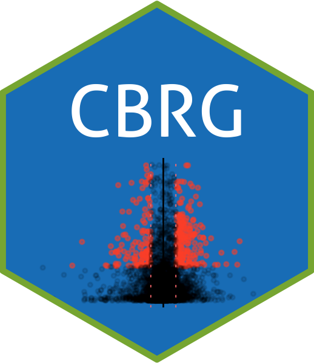

---
output:
  md_document:
    variant: gfm
html_preview: false
---

<!-- README.md is generated from README.Rmd. Please edit that file -->

```{r, include = FALSE}
knitr::opts_chunk$set(
  collapse = TRUE,
  comment = "#>",
  fig.path = "man/figures/README-",
  out.width = "100%"
)
```

```{r echo=FALSE, results="hide", message=FALSE}
library("badger")
```


<!-- For more info: https://usethis.r-lib.org/reference/use_readme_rmd.html -->

# :computer::pill: Computational Biology Reading Group (CBRG)
`r badger::badge_custom("lifecycle", "experimental", "orange")`

<!--  -->

<!-- badges: start -->
<!-- badges: end -->

The CBRG is a group that meets weekly on Wednesdays from 11 AM to Noon at the Michelle Winn Conference room in the [Duke Molecular Physiology Department (DMPI)](https://dmpi.duke.edu)  

*This package contains relevant data, files, and functions for this reading groups*  

All meetups will be live-streamed and recorded here - 

## :arrow_down: Installation

You can install this package from [GitHub](https://github.com/) with:

``` r
# install.packages("devtools")
devtools::install_github("BAREJAA/CBRG", force = TRUE)
```
This package will be frequently updated, so please *ensure that you also frequently re-install this package* ("frequent" being around once a week if you would like to keep up-to-date)  

## :mega: Discussions

If you have any questions or would like to introduce yourself, you can do so by using this [Discussions](https://github.com/BAREJAA/CBRG/discussions) page. You can also use this page to post information you think others might find useful, and submit ideas and suggestions for how to improve this group/package    

## :wrench: Issues and Problems  

If you notice something wrong with the package, you can open an issue on the [Issues page](https://github.com/BAREJAA/CBRG/issues), and we will try to fix your problem  

## :closed_book: Resources  

Our goal is to work through various relevant books, beginning with the following - 
[Computational Genomics with R](http://compgenomr.github.io/book/) by Prof. Altuna Akalin  

We will also discuss relevant examples from other sources  

<!-- Useful info below -->

<!-- ## Example -->

<!-- This is a basic example which shows you how to solve a common problem: -->

<!-- ```{r example} -->
<!-- library(CBRG) -->
<!-- ## basic example code -->
<!-- ``` -->

<!-- What is special about using `README.Rmd` instead of just `README.md`? You can include R chunks like so: -->

<!-- ```{r cars} -->
<!-- summary(cars) -->
<!-- ``` -->

<!-- <!-- You'll still need to render `README.Rmd` regularly, to keep `README.md` up-to-date. `devtools::build_readme()` is handy for this.  --> -->
<!-- You can also embed plots, for example: -->

<!-- ```{r pressure, echo = FALSE} -->
<!-- plot(pressure) -->
<!-- ``` -->

<!-- In that case, don't forget to commit and push the resulting figure files, so they display on GitHub and CRAN. -->
