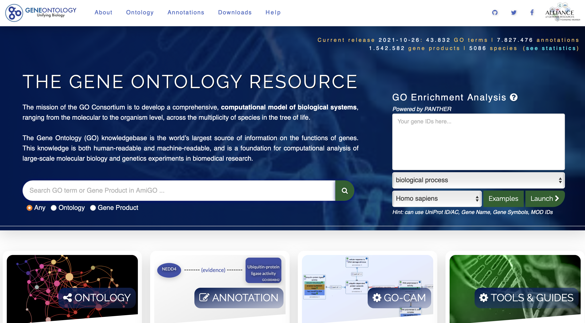
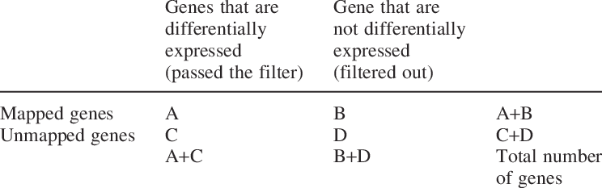

```{r setup, include=FALSE}
knitr::opts_chunk$set(message = FALSE, warning = FALSE, comment = "", cache = F,
                      fig.align = "center", out.width = "90%")
options(htmltools.dir.version = FALSE)
library(tidyverse)
library(kableExtra)
library(xaringanExtra)
library(janitor)
library(xaringanthemer)
library(knitr)
library(tidybiology)
data(proteins)

golub_subjects <- readr::read_csv("https://raw.githubusercontent.com/BAREJAA/website_for_john/master/datasets/golub_kaggle/golub_subjects.csv")
```

```{r xaringan-themer, include=FALSE, warning=FALSE}
style_mono_accent(
  base_color = "#00539B",
  header_font_google = google_font("Adobe Caslon"),
  text_font_google   = google_font("Adobe Caslon", "300", "300i"),
  code_font_google   = google_font("Fira Mono")
)
```

```{r xaringanExtra-freezeframe, echo = FALSE, message = FALSE}
options(htmltools.dir.version = FALSE)
xaringanExtra::use_freezeframe()
```

```{r xaringanExtra-clipboard, echo=FALSE}
xaringanExtra::use_clipboard()
```

```{r xaringan-panelset, echo=FALSE}
xaringanExtra::use_panelset()
```

class: center, middle

# Enrichment Analyses

---

# Gene Ontology (GO)

```{r echo = FALSE, out.width = "90%"}

```

.footnote[

geneontology.org

]

---

# Three GO Domains  

--

### **Molecular Function (MF)** 

  - Functional activities 

--

### **Biological Process (BP)** 

  - Larger biological role

--

### **Cellular Component (CC)** 

  - Cellular location

---

# GO: "Hexose Biosynthetic Process"

.center[

```{r echo = FALSE, out.width = "55%"}
knitr::include_graphics("http://geneontology.org/assets/hexose-biosynthetic-process.png")
```

]

---

# ORA

### Fisher test

### Hypergeometric test

<br/>

```{r echo = FALSE, out.width = "90%"}

```

---

# GSEA

```{r echo = FALSE, out.width = "90%"}
knitr::include_graphics("https://www.pnas.org/content/pnas/102/43/15545/F1.large.jpg?width=800&height=600&carousel=1")
```

.footnote[

Subramanian (2005) *PNAS* 102 (43) 15545-15550

]

